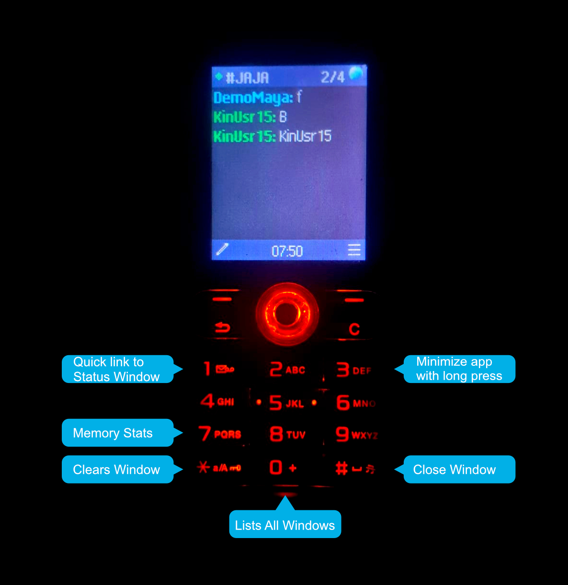
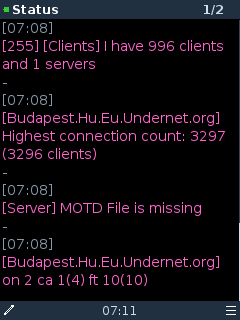
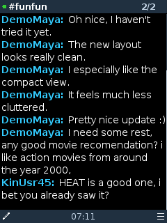
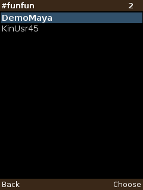
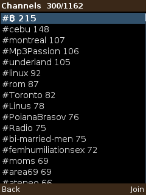
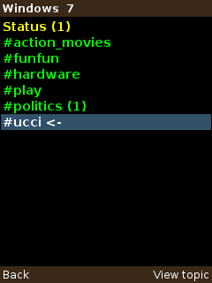
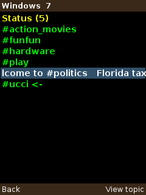
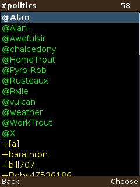

# KinIRC

IRC client for J2ME phones (MIDP 2.0 / CLDC 1.1). Tested on Sony Ericsson W200i (128x160); adapts automatically to bigger screens (240x320+).

## Features

- Multi-window chat: Status, channels and queries, with position strip and indicator.
- Color nick list (@ and +), server channel list, window list with topic ticker.
- Auto-reconnect with backoff, keep-alive, power-save PART/JOIN on minimize.
- Sound or vibration alerts, highlighted mentions, text-only mode.
- English and Spanish, 4 font sizes, configurable refresh.

## Requirements

- Phone with Java MIDP 2.0 (e.g. Sony Ericsson W200i and contemporaries).

## Install

1. Send `app.jad` and `KinIRC.jar` to the phone (Bluetooth, USB or WAP).
2. Open the `.jad` or `.jar` to install.
3. Create a profile (server, nick, channels) and connect. No default server: find one at https://netsplit.de/networks/top100.php.

See [MANUAL.md](MANUAL.md) for keys, colors and every feature.

## Build

JDK 8 is required (classes must be v45 for the KVM):

JDK8_HOME=/path/to/temurin8 \
CLDC_API=/path/to/cldc11.jar \
MIDP_API=/path/to/midp21.jar \
./build.sh

Produces `KinIRC.jar` + `app.jad` (JAD size updated automatically).

## Screenshots

